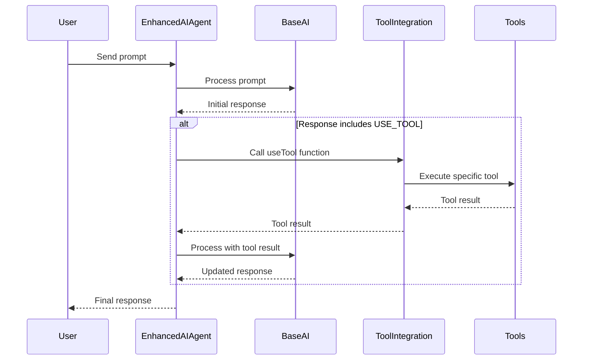

# 🤖 Enhanced AI Agent

Welcome to the Enhanced AI Agent documentation! This guide will help you understand, use, and extend our AI agent that has been augmented with various tools to enhance its capabilities.

## 📚 Table of Contents

- [🤖 Enhanced AI Agent](#-enhanced-ai-agent)
  - [📚 Table of Contents](#-table-of-contents)
  - [Overview](#overview)
  - [How It Works](#how-it-works)
  - [Usage](#usage)
  - [Configuration](#configuration)
  - [Extending the Agent](#extending-the-agent)
  - [Testing](#testing)
  - [Best Practices](#best-practices)
  - [Troubleshooting](#troubleshooting)

## Overview

The Enhanced AI Agent is a sophisticated AI model that can leverage various tools to augment its capabilities. It can perform tasks such as web scraping, file manipulation, natural language processing, API interactions, and data visualization, in addition to its base language model capabilities.

## How It Works

The Enhanced AI Agent follows this general process:

1. Receive a prompt from the user
2. Process the prompt using its base language model
3. If the response includes a tool command, execute the specified tool
4. Incorporate the tool's output into its reasoning
5. Generate a final response

Here's a flowchart illustrating this process:



## Usage

To use the Enhanced AI Agent in your project:

1. Import the agent:
   ```javascript
   const { enhancedAIAgent } = require('./agents/enhancedAIAgent');
   ```

2. Call the agent with a prompt:
   ```javascript
   const response = await enhancedAIAgent('What is the weather like in New York?');
   console.log(response);
   ```

Example usage in an async function:

```javascript
async function getWeatherReport() {
  try {
    const response = await enhancedAIAgent('Give me a detailed weather report for New York City, including temperature and precipitation chances for the next 3 days.');
    console.log('Weather Report:', response);
  } catch (error) {
    console.error('Error getting weather report:', error);
  }
}

getWeatherReport();
```

## Configuration

The Enhanced AI Agent relies on environment variables for configuration. Ensure you have the following variables set in your `.env` file:

```
API_URL=http://your-ai-model-api-url.com
MODEL_NAME=your-ai-model-name
```

## Extending the Agent

To extend the Enhanced AI Agent's capabilities:

1. Add new tools to the `tools/` directory (refer to the Tools Framework documentation).
2. Update the `toolIntegrationFramework.js` to include the new tool.
3. Modify the `enhancedAIAgent.js` if necessary to handle new tool types or special cases.

Example of adding a new tool interaction:

```javascript
if (response.includes('USE_NEW_TOOL:')) {
  const newToolResult = await useTool('newTool', ...args);
  response = await askAI(process.env.API_URL, process.env.MODEL_NAME, 
    `New tool result: ${newToolResult}\n\nBased on this, ${prompt}`);
}
```

## Testing

We use Jest for testing the Enhanced AI Agent. To run tests:

```
npm test agents/enhancedAIAgent.test.js
```

When writing tests, remember to mock external dependencies and the base AI model to ensure isolated testing of the agent's logic.

Example test:

```javascript
test('uses a tool when instructed by AI response', async () => {
  askAI.mockResolvedValueOnce('USE_TOOL: webScraper https://example.com')
       .mockResolvedValueOnce('The weather is sunny based on the scraped data.');
  useTool.mockResolvedValue('Scraped content: Today is sunny.');

  const result = await enhancedAIAgent('What is the weather like?');

  expect(useTool).toHaveBeenCalledWith('webScraper', 'https://example.com');
  expect(result).toBe('The weather is sunny based on the scraped data.');
});
```

## Best Practices

1. **Error Handling**: Implement robust error handling to gracefully manage failures in tool execution or AI processing.
2. **Prompt Engineering**: Carefully design prompts to effectively utilize the agent's capabilities and tools.
3. **Security**: Be cautious when processing user inputs to prevent potential security vulnerabilities.
4. **Performance**: Monitor the performance impact of tool usage and optimize where necessary.
5. **Logging**: Implement comprehensive logging for debugging and monitoring purposes.

## Troubleshooting

Common issues and solutions:

1. **Tool not found**: Ensure the tool is properly added to the `toolIntegrationFramework.js` file.
2. **API errors**: Check your `.env` file for correct API_URL and MODEL_NAME values.
3. **Unexpected responses**: Review your prompt structure and consider adjusting it for better results.

If you encounter persistent issues, please check the project's issue tracker or contact the development team.

---

We hope this guide helps you effectively use and extend the Enhanced AI Agent. Happy coding! 🚀