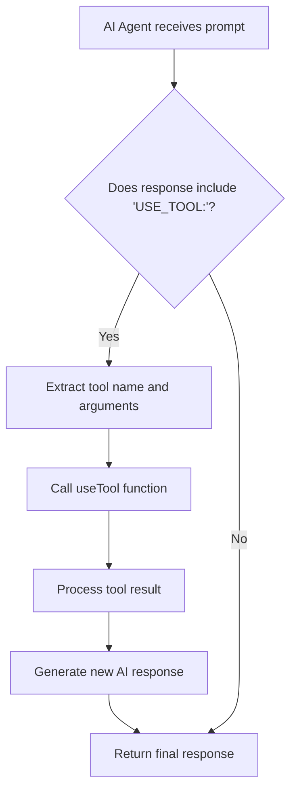

# 🛠️ AI Agent Tools Framework

Welcome to the AI Agent Tools Framework! This system allows our AI agents to interact with various tools, expanding their capabilities beyond simple text processing. This README will guide you through the structure, usage, and extension of our tools framework.

## 📚 Table of Contents

- [🛠️ AI Agent Tools Framework](#️-ai-agent-tools-framework)
  - [📚 Table of Contents](#-table-of-contents)
  - [Overview](#overview)
  - [Tool Integration Process](#tool-integration-process)
  - [Available Tools](#available-tools)
  - [How to Use Tools](#how-to-use-tools)
    - [Specific Tool Usage Examples](#specific-tool-usage-examples)
  - [Adding New Tools](#adding-new-tools)
  - [Testing Tools](#testing-tools)
  - [Best Practices](#best-practices)
  - [External Dependencies](#external-dependencies)

## Overview

Our tools framework is designed to provide AI agents with a set of capabilities that extend beyond text processing. Each tool is a module that performs a specific function, such as web scraping, file manipulation, or data visualization. The framework is built with modularity and extensibility in mind, allowing easy addition of new tools as needed.

## Tool Integration Process

Here's a flowchart illustrating how tools are integrated into the AI agent's workflow:



## Available Tools

Currently, our framework includes the following tools:

1. **Web Scraping Tool** (`webScrapingTool.js`): Fetches and parses content from web pages.
2. **File System Tool** (`fileSystemTool.js`): Reads from and writes to files on the local system.
3. **NLP Tool** (`nlpTool.js`): Performs natural language processing tasks like sentiment analysis and named entity recognition.
4. **API Interaction Tool** (`apiInteractionTool.js`): Interacts with external APIs.
5. **Data Visualization Tool** (`dataVisualizationTool.js`): Generates visual representations of data.

## How to Use Tools

To use a tool within an AI agent, follow these steps:

1. Import the `useTool` function from the tool integration framework:

   ```javascript
   const { useTool } = require('./tools/toolIntegrationFramework');
   ```

2. Call the `useTool` function with the tool name and necessary arguments:

   ```javascript
   const result = await useTool('webScraper', 'https://example.com');
   ```

3. Process the result as needed in your AI agent logic.

Example usage in an AI agent:

```javascript
async function enhancedAIAgent(prompt) {
  let response = await askAI(process.env.API_URL, process.env.MODEL_NAME, prompt);
  
  if (response.includes('USE_TOOL:')) {
    const toolInstructions = response.split('USE_TOOL:')[1].trim();
    const [toolName, ...args] = toolInstructions.split(' ');
    
    const toolResult = await useTool(toolName, ...args);
    
    response = await askAI(process.env.API_URL, process.env.MODEL_NAME, 
      `Here's the result of using the ${toolName} tool: ${toolResult}\n\nBased on this, ${prompt}`);
  }
  
  return response;
}
```

### Specific Tool Usage Examples

1. **Web Scraping Tool**:
   ```javascript
   const webContent = await useTool('webScraper', 'https://example.com');
   console.log('Scraped content:', webContent);
   ```

2. **File System Tool**:
   ```javascript
   const fileContent = await useTool('readFile', 'path/to/file.txt');
   console.log('File content:', fileContent);
   
   await useTool('writeFile', 'path/to/newfile.txt', 'Hello, World!');
   console.log('File written successfully');
   ```

3. **NLP Tool**:
   ```javascript
   const sentiment = await useTool('analyzeSentiment', 'I love this product!');
   console.log('Sentiment:', sentiment);
   
   const entities = await useTool('findNamedEntities', 'John visited New York last summer.');
   console.log('Named entities:', entities);
   ```

4. **API Interaction Tool**:
   ```javascript
   const apiResponse = await useTool('makeApiRequest', 'https://api.example.com/data', 'GET');
   console.log('API response:', apiResponse);
   ```

5. **Data Visualization Tool**:
   ```javascript
   const chartUrl = await useTool('createBarChart', 'Sales Data', ['Jan', 'Feb', 'Mar'], [100, 150, 200]);
   console.log('Chart URL:', chartUrl);
   ```

## Adding New Tools

To add a new tool to the framework:

1. Create a new file in the `tools/` directory (e.g., `myNewTool.js`).
2. Implement your tool's functionality in this file.
3. Export the tool's functions.
4. Add the tool to `toolIntegrationFramework.js`:

   ```javascript
   const myNewTool = require('./myNewTool');

   const toolbox = {
     // ... existing tools ...
     myNewTool: myNewTool.mainFunction
   };
   ```

5. Update this README to include information about your new tool.

## Testing Tools

We use Jest for testing our tools. To test a new tool:

1. Create a test file in the `tools/` directory (e.g., `myNewTool.test.js`).
2. Write tests that cover the main functionality of your tool.
3. Mock any external dependencies to ensure isolated unit testing.

Example test structure:

```javascript
const { myNewTool } = require('./myNewTool');

jest.mock('external-dependency');

describe('myNewTool', () => {
  test('performs expected operation', async () => {
    const result = await myNewTool('input');
    expect(result).toBe('expected output');
  });
});
```

Run tests using the command: `npm test`

## Best Practices

1. **Modularity**: Keep each tool focused on a specific task or domain.
2. **Error Handling**: Implement robust error handling in each tool.
3. **Documentation**: Thoroughly document each tool's purpose, inputs, and outputs.
4. **Testing**: Write comprehensive tests for each tool.
5. **Security**: Be mindful of security implications, especially for tools that interact with external systems or sensitive data.
6. **Performance**: Consider the performance impact of tools, especially those that may be called frequently.

## External Dependencies

Our tools rely on several external libraries. Here are links to their documentation:

- [Axios](https://axios-http.com/docs/intro): Used for making HTTP requests in the Web Scraping and API Interaction tools.
- [Cheerio](https://cheerio.js.org/): Used for parsing HTML in the Web Scraping tool.
- [Natural](https://naturalnode.github.io/natural/): Used for natural language processing tasks in the NLP tool.
- [Chart.js](https://www.chartjs.org/docs/latest/): Used for creating charts in the Data Visualization tool.
- [chartjs-to-image](https://github.com/typpo/chartjs-to-image): Used for converting Chart.js configurations to image URLs in the Data Visualization tool.

Make sure to keep these dependencies up-to-date and refer to their documentation when extending or modifying the tools.

By following these guidelines and using this framework, you can create powerful, extensible AI agents capable of a wide range of tasks. Happy coding! 🚀